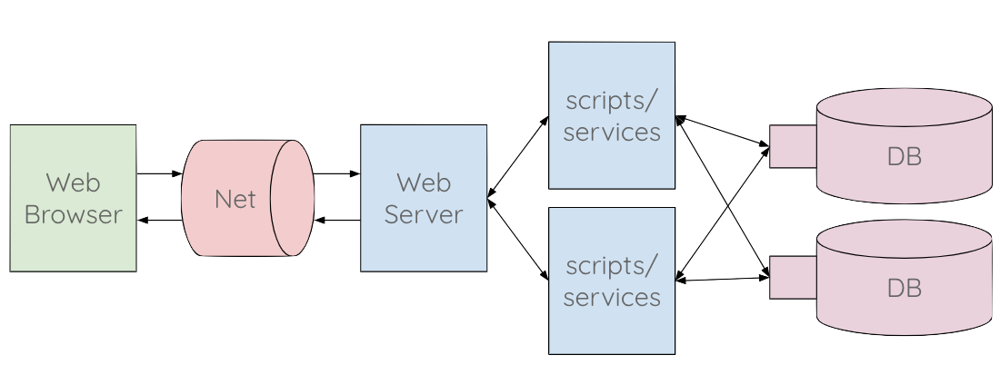

# Sistemi distribuiti

## Premessa
In Informatica state imparando a programmare una singola macchina con vari linguaggi di programmazione (C++/Java,PHP) e a connettervi ad un database MySQL. Con Sistemi e Reti state imparando a configurare una rete di computer e connettervi in modo efficiente e sicuro ad un computer remoto.

Scopo di TPSI di quest'anno è la realizzazione di un servizio web, che quindi prevede la cooperazione di diverse tecnologie, linguaggi, macchine, dispositivi. Cercheremo di imparare cosa significa sistema distribuito e, soprattutto, come si realizza.

## Sistemi monolitici e distribuiti
Immaginate di dover scrivere un documento di testo con Microsoft Word (versione classica). Accendo il computer, avvio l'applicazione, scrivo il mio documento, lo salvo e lo stampo. Nella redazione del mio documento, ci sono poche cose che possono andare storto: se il mio computer non ha particolari problemi dovrebbe andare tutto liscio. Se voglio inviarlo a qualcuno, lo salvo su una chiavetta o glielo invio per posta elettronica, Whatsapp o Telegram. Che succede però se il mio computer si rompe? Se non ho fatto backup recenti (cosa che succede regolarmente), rischio di perdere tutto o parte del lavoro. E se non ho il computer con me? Non posso lavorare sul mio file.

Ora immaginiamo di scrivere lo stesso documento con Google Docs. Accendo il computer, _apro il browser_, _mi connetto ad internet_, _faccio l'accesso a Google_, quindi apro Docs e comincio a scrivere. Se voglio condividere il file, posso inviare il link impostando adeguatamente i permessi di accesso. Se non ho il computer con me, posso usare un qualsiasi altro computer. Ci sono diverse cose che possono andare storto prima di riuscire a scrivere il documento: internet non funziona, mi sono dimenticato la password, etc. Però ho il mio file disponibile sempre e con una bassissima probabilità di perderlo.

Nel primo caso, ci troviamo davanti un'applicazione _monolitica_, o _single tier_: tutto risiede in una macchina. Nel secondo caso ho un'applicazione _distribuita_, o _multi tiers_: per fruire del servizio ho bisogno di più macchine (almeno due: la mia e il server di Google Docs).

## Una definizione
Esistono varie definizioni, qui ne forniamo una:

"Un sistema distribuito consiste di un insieme di calcolatori autonomi, connessi fra loro tramite una rete e un middleware di distribuzione, che permette ai computer di coordinare le loro attività e di condividere le risorse del sistema, in modo che gli utenti percepiscano il sistema come un unico servizio integrato di calcolo."
([Wolfgang Emmerich, 1997](http://www0.cs.ucl.ac.uk/staff/ucacwxe/lectures/ds98-99/dsee3.pdf))

Nella definizione voglio sottolineare come, per funzionare, un sistema distribuito deve:
 - prevedere più computer che si coordinano fra di loro
 - usare risorse condivise

## Architettura 3-tiers
L'architettura che ci interessa particolarmente è quella con 3 strati, chiamati tecnicamente in inglese "tiers".

1. Client (es. browser, app nativa)
1. Web server + application server (es. nginx/apache + PHP)
1. Database (es. MySQL, MariaDB, Oracle)

Ci si può chiedere perché usare due macchine per i server, anziché una sola: ci sono vari motivi, ma principalmente perché:
- il database contiene dati riservati e deve essere più protetto, quindi meglio che stia dietro un'altro strato che fa da intermediario
- il database deve risiedere in delle macchine con dei requisiti di affidabilità e ridondanza molto elevati, quindi molto costose, ed è quindi più vantaggioso economicamente separarlo dal web/application server

## Architettura 4-tiers
In molte situazioni può essere utile separare ulteriormente il web server e l'application server in due tier distinti, ottenendo la seguente architettura:
1. client
1. web server
1. application server
1. database

In questo modo ho una serie di vantaggi:
- posso cambiare la macchina dell'application server senza dover cambiare l'indirizzo IP pubblico del web server (e quindi il DNS)
- posso dirottare le richieste dei client a più di un application server, sia sia per bilanciamento del carico, sia per gestire richieste di tipo diverso

## Architettura n-tiers
Posso ulteriormente separare l'application server in più tiers, in caso di necessità. Le web application più complesse possono essere composte anche da 6 o 7 tiers.

Ad esempio potrei avere una architettura come segue:
1. client
1. web server
1. presentation tier: compone le pagine mettendo insieme parti provenienti da diverse macchine dello strato successivo
1. business logic tier: il codice più significativo della web application
1. data access tier: strato che permette un accesso omogeneo dei dati
1. database: uno o più database che contengono effettivamente i dati

### Alcune precisazioni importanti
Il termine tecnico "tier" sta ad indicare uno "strato" che può comunicare solo con quelli adiacenti e non con altri. Quindi un'architettura "client - server - database" è del tutto diversa da un'architettura "client - database - server" (che non avrebbe senso).

Si usa "tier" anziché "layer" per specificare che si usano macchine (fisiche o virtuali) diverse. Quindi un "layer" potrebbe essere qualcosa di puramente logico o concettuale, mentre "tier" deve essere legato ad una macchina specifica. Per semplificare, possiamo definire una "macchina" come un sistema di elaborazione che ha un proprio IP e comunica con gli i tiers adiacenti con protocolli di rete.

## Da studiare
Cercare sul manuale per l'esame i sistemi distribuiti e studiare i relativi paragrafi.

