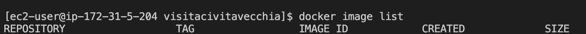
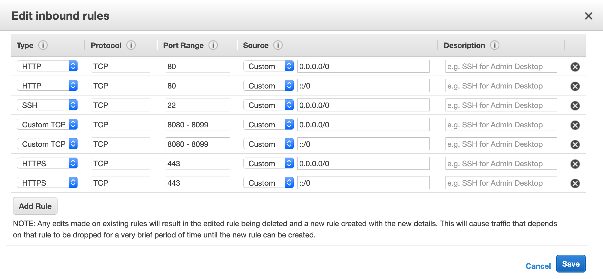
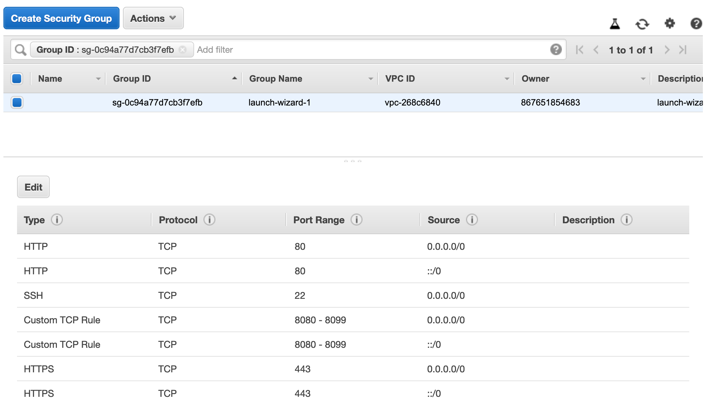

# Cloud - Tutorial

In questa sezione vedremo praticamente come fare il deploy di una applicazione in cloud con AWS.

## Creare un'istanza
Dopo aver fatto il login, nella pagina che vi si presenta selezionare "Go to Classroom" e quindi la propria classe.

Dopo un paio di click si dovrebbe aprire una pagina di Vocareum, dove potete vedere il vostro credito residuo. Cliccate sul bottone AWS Console.

Ora vi ritrovate in una console reale di AWS! Ricordatevi di rimanere sempre in Virginia Settentrionale, altrimenti il vostro credito _non_ funzionerà.

Dalla lista dei servizi in alto, selezionate EC2. Nella pagina che si apre, selezionate il bottone blu per lanciare una nuova istanza. Lasciate tutto di default: Linux Amazon 2 AMI su x86 a 64bit, e t2.micro.

Generate una nuova chiave privata quando richiesto, con il vostro cognome tutto minuscolo. **ATTENZIONE!** mettete la chiave privata in un luogo sicuro, per esempio inviatevela per posta o copiatela su una chiavetta. Se perdete il file, non potrete più accedere alla vostra istanza; se qualcuno entra in possesso del file, potrà entrare e modificare la vostra istanza cloud.

Non chiudere la finestra della dashboard, ci servirà in seguito.

**CHECKPOINT**
Controllare sulla dashboard che l'istanza sia "running".

<p class="centered img-container">

</p>


## Accedere all'istanza da VSCode
In questo tutorial accederemo all'istanza direttamente da Visual Studio Code, perché ci permetterà uno sviluppo più rapido e senza intoppi.

### Installare Remote-SSH extension
Aprire VSCode, andare nel pannello verticale a sinistra su "Extensions", cercare ed installare l'estensione [Remote - SSH](https://marketplace.visualstudio.com/items?itemName=ms-vscode-remote.remote-ssh) di Microsoft.

Dopo l'installazione, vi comparirà una nuova icona nel pannello a sinistra e un quadratino verde in basso a sinistra.

**CHECKPOINT**
Controllare che VSCode sia come in figura.

<p class="centered img-container">

</p>

### Copiare la chiave
Per potersi connettere correttamente, la vostra chiave privata deve stare dentro la cartella `.ssh` della vostra home.

1. controllate che esista la cartella `.ssh` dentro `C:\Users\NomeUtente\`, se non esiste createla
2. copiate la vostra chiave privata all'interno della cartella

**CHECKPOINT**
Controllare che la vostra chiave privata sia all'interno della cartella `.ssh` del vostro utente.


### Configurare il target

1. da VSCode, premere sull'icona "Remote Explorer" nel pannello di sinistra.
2. passare il mouse nella barra dove è scritto "SSH Targets" e premere su `+`
3. copiare dalla dashboard di AWS la stringa per connettersi alla macchina e incollarla nella casella di VSCode; la stringa la trovate selezionando l'istanza e facendo click su "Connect" in alto.

<p class="centered img-container">

</p>

**Checkpoint**
Tra i target SSH deve comparire la nuova macchina appena creata.

<p class="centered img-container">

</p>

4. sulla barra di SSH Targets, cliccare sulla rotella e cliccate sulla prima voce
5. modificare il campo `IdentityFile` con il percorso completo della vostra chiave, ovvero `C:\Users\NomeUtente\.ssh\nomechiave.pem`
6. modificate il campo `Host` e mettete il vostro cognome

**Checkpoint**
Il file di configurazione dovrebbe apparire ora in modo simile a questo.

<p class="centered img-container">

</p>


### Connettersi alla macchina remota
Da VSCode, connettetevi al target appena creato premendo sulla piccola icona con la finestra ed il + vicino al nome del target. Vi si aprirà una nuova finestra con una sessione di VSCode sulla macchina remota.

Aprite un terminale da VSCode.

**Checkpoint**
Controllate di avere una finestra del genere e che l'utente remoto da terminale sia `ec2-user`.


<p class="centered img-container">

</p>

#### Troubleshooting
Su _Windows_, anche se avete fatto tutto giusto, vi potrebbe comparire una finestra di errore con scritto "errore PATH" o "SSH non trovato". Il problema è probabilmente che VSCode non riesce a trovare l'eseguibile corretto per `ssh`. 

Per risolvere il problema fate le seguenti operazioni:
1. se non l'avete già fatto, installate [git-bash](https://git-scm.com/download/win)
2. dal menu start, cliccate con il tasto destro sull'eseguibile "Git Bash" appena installato e selezionate "Proprietà"
3. copiate il percorso del file dell'eseguibile (qualcosa tipo `C:\Users\NomeUtente\AppData\Local\Git\`) e incollatelo nella barra di Esplora Risorse
4. navigate dentro le cartelle `usr` e `bin`
5. dentro la cartella bin, controllate che ci sia il file `ssh.exe`
5. selezionate il percorso di questa cartella
6. ora aprite VSCode e andate sulle impostazioni premendo la rotella in basso a sinistra e selezionando "Settings"
7. nella barra di ricerca delle impostazioni, scrivete `remote.ssh.path`
8. nel campo che vi si aprirà, incollate il path che avevate copiato poco fa e aggiungete anche `ssh.exe` alla fine

Il risultato dovrebbe essere qualcosa del genere.
<p class="centered img-container">

</p>


## Configurare l'istanza al primo avvio
Ora che siamo riusciti a connetterci l'istanza, dobbiamo configurarla per i nostri scopi.

Quello che andiamo a fare, è installare sulla macchina remota gli eseguibili che ci serviranno per completare il progetto:
- docker
- docker-compose
- git

Per configurare l'istanza, la prima volta copiate i seguenti comandi.

Suggerimento: nel riquadro qui sotto, in alto a destra trovate l'icona delle pagine per copiare tutti i comandi in una volta sola.

```sh
sudo yum update -y

# install docker
sudo yum install docker -y
# add docker to the admin group, so we can use it without sudo
sudo groupadd docker
sudo usermod -aG docker $USER
# add docker to startup services
sudo chkconfig docker on
sudo systemctl enable docker
# install docker-compose
sudo curl -L "https://github.com/docker/compose/releases/download/1.23.2/docker-compose-$(uname -s)-$(uname -m)" -o /usr/local/bin/docker-compose
sudo chmod +x /usr/local/bin/docker-compose
# install git
sudo yum install git -y
```

**CHECKPOINT** Eseguite i seguenti comandi qui sotto e assicuratevi di non avere messaggi di errore.

```sh
docker --version
docker-compose --version
git --version
```

<p class="centered img-container">

</p>

### Riavvio della macchina
Per fare in modo che le impostazioni abbiano effetto, eseguite le seguenti operazioni:
- chiudete la finestra di VSCode connessa alla macchina remota
- dalla dashboard di EC2, selezionare Actions->Instance State->Reboot (**non** fermate o terminate la macchina, altrimenti il vostro dns pubblico cambierà!)

<p class="centered img-container">

</p>

- aspettate qualche secondo che si riavvii la macchina
- da VSCode, riconnettersi alla macchina remota

**Checkpoint**
Eseguite il seguente comando:
```sh
docker image list
```

e controllate di avere un output del genere:

<p class="centered img-container">

</p>

> Se una volta ricollegati alla macchina remota con VSCode, il comando docker image list non dovesse funzionare, lanciate il comando `sudo systemctl start docker` e riprovate

Se tutto va bene, avete il vostro ambiente pronto e configurato!

## Installazione del progetto template
Ora è il momento di scaricare un progetto template per fare le nostre prove di HTML5+PHP+MySQL.

### Creazione del repository
Prima di tutto create un nuovo repository partendo da un mio template.
- fate il login su GitHub
- andate su [github.com/wbigger/html5-php-sql](https://github.com/wbigger/html5-php-sql)
- cliccate su "Use this template"

<p class="centered img-container">

</p>

- chiedete al vostro professore quale nome dare al repository
- nella descrizione, mettete anno scolastico, classe e materia
- lasciate le impostazioni su _Public_
- create il repository
- dal solito bottone verde "Clone or Download", copiate il link al vostro nuovo repo

**Checkpoint** Dovete avere un vostro repository simile a questa pagina.

<p class="centered img-container">

</p>


### Clone del repository
Dalla finestra di VSCode connessa con la vostra macchina remota, andate sul terminale e digitate:

```sh
git clone <nomeRepository>
```

Ora sempre da VSCode andate su File->Apri e selezionate la cartella del repository appena creato.

***Checkpoint** Controllate che le aree cerchiate in rosso corrispondano ai nomi che avete dato al vostro progetto.

<p class="centered img-container">

</p>

## Avvio della web application

Ora abbiamo finalmente tutti i pezzi necessari per avviare la nostra web application.

Dalla finestra remota di VSCode, nel terminale, digitate:

```sh
docker-compose up
```

La prima volta ci metterà un po' di più perché vi scaricherà le dipendenze del progetto (nginx, MySql, PHP, PHP MyAdmin). 

**Checkpoint**
Dopo che avrà finito di far scorrere tutte le stampe di inizializzazione (potrebbe metterci un po'), il vostro terminale deve essere simile all'immagine seguente.

<p class="centered img-container">

</p>

> Per chiudere l'applicazione, dovete lanciare il comando `docker-compose down`.

### Aprire le porte nell'istanza EC2
La nostra webapp è pronta sul server, ma prima di poter accedere dobbiamo aprire le porte corrispondenti.

Sicuramente vogliamo aprire le porte 80 e 443 per accedere in HTTP e HTTPS. Inoltre, in questo progetto ci sono diverse porte di debug aperte tra 8080 e 8099. Per fortuna con AWS possiamo aprirle tutte in un colpo solo. 

Andate sulla dashboard AWS, selezionate l'istanza e nel pannello in basso selezionate il vostro security group.

<p class="centered img-container">

</p>

Cliccate nel pannello in basso su "Inbound" e quindi "Edit".

<p class="centered img-container">

</p>

Aprite le porte come indicato nella figura qui sotto.

<p class="centered img-container">

</p>

Salvate le modifiche.

**Checkpoint** Il vostro security group dovrebbe apparire ora come segue.
<p class="centered img-container">

</p>

## Verifica finale
Ora la vostra web app è pronta sul web!

Dalla dashboard di AWS, copiate il DNS pubblico della vostra macchina e incollatelo in un browser. In questo momento il server è configurato per funzionare con la porta 8097, quindi ricordatevi di metterla nell'indirizzo.

<p class="centered img-container">

</p>

Da qui in poi possiamo cominciare a modificare il nostro progetto e vedere le modifiche live sul world wide web!

## Riepilogo
Rivediamo cosa abbiamo fatto.

- abbiamo creato una macchina virtuale sul cloud con Amazon Web Services
- abbiamo configurato Visual Studio Code per accedere a questa istanza
- abbiamo configurato l'istanza con i comandi che ci servivano, in particolare `docker`, `docker-compose` e `git`
- abbiamo creato un repository su GitHub partendo da un template
- abbiamo clonato il repository sulla macchina remota
- abbiamo lanciato il progetto template
- docker si è scaricato le dipendenze del nostro progetto template (`nginx`,`PHP`, `MySQL`, `PHP MyAdmin`)
- abbiamo aperto le porte necessarie nella nostra macchina remota
- la webapp è pronta all'uso
