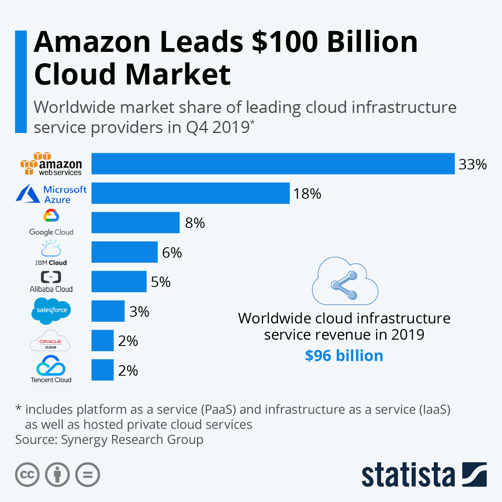

# Cloud computing
Un'azienda invece di dislocare le proprie risorse e servizi su una macchina all'interno dei locali dell'azienda stessa, può scegliere di dislocarli su macchine non di sua proprietà posizionate da qualche parte nel mondo in dei locali insieme ad altre decine, centinaia o migliaia di macchine che servono anche altre aziende. Questi locali vengono chiamate _server-farm_ o _data center_. Per farvi un'idea, potete guardare il tour virtuale dei data center di Google.

<iframe width="560" height="315" src="https://www.youtube.com/embed/XZmGGAbHqa0" frameborder="0" allow="accelerometer; autoplay; encrypted-media; gyroscope; picture-in-picture" allowfullscreen></iframe>

La diffusione del cloud è anche stata resa possibile dalla diffusione capillare della fibra ottica in molte città del mondo, che hanno permesso di usufruire velocemente di servizi web ovunque ed in qualsiasi momento.

Alcuni punti critici sono legati alla privacy: i dati sono fisicamente ospitati su qualche server remoto, con minor controllo sull'accesso ai dati da terze parti. Alcune leggi europee limitano l'utilizzo del cloud per alcune categorie di enti pubblici e privati, per esempio richiedendo che i data center siano risiedano sul territorio della comunità europea (in altre parole, non si possono usare data center in USA o Cina).

> Anche per uso personale il cloud ormai è estremamente diffuso: pensate ad esempio a Dropbox, Google Drive, Google Docs, la web mail e servizi analoghi. Sono tutte applicazioni che conservano e gestiscono file ed informazioni in cloud.

### Stima dei costi
Un buon modo per fare una stima dei costi per il cloud è usare qualche calcolatore online, per esempio [questo ufficiale] di AWS.

Per il caso di un'azienda di medie dimensioni che offre un servizio web (circa 20 dipendenti in un'unica sede) ho fatto [questa](https://calculator.s3.amazonaws.com/index.html#r=IAD&key=files/calc-ef98cd6733141d329fbbcaffe1d59a4e1ac16a7b&v=ver20200204w5) stima. 

|Service Type|Service Price|
|---|---|
|Amazon EC2 Service | $243.61|
|Amazon S3 Service|$24.44|
|Amazon RDS Service|$694.04|
|Amazon Elastic Load Balancing |$26.5|
|AWS Support (Basic)|$0|
|**Total Monthly Payment**|**$967.73**|

Ci aggiriamo in questo caso intorno ai 1000 dollari al mese. 

### Attenzione alle ipotesi aggiuntive
Per poter fare una stima dei costi è di fondamentale importanza fare un dimensionamento delle esigenze del cliente. Mi serve sapere almeno quanti utenti avrà il servizio richiesto (10? 100? 1000? un milione?) e da dove accedono (unica sede? tante sedi? tutta Italia? tutto il mondo?).

Se i requisiti scritti non mi danno direttamente queste informazioni, le devo reperire chiedendo al cliente oppure, nel caso dei compiti in classe e dell'esame di stato, scrivendo delle _opportune ipotesi aggiuntive_.

### Pro & Cons
Pro
- nessun costo iniziale
- paghi solo quello che usi (pay as you go)
- altissima scalabilità
- funzionalità continuamente aggiornate
- alti livelli di sicurezza e ridondanza dei dati

Cons
- costi alla lunga potenzialmente più alti del cloud
- si è maggiormente suscettibili di variazioni di prezzo del mercato dei servizi cloud
- la connessione internet può essere un collo di bottiglia per la fruizione dei servizi da rete locale
- i miei dati sono su macchine non mie
- normative che ne restringono l'uso

La soluzione cloud è preferibile per piccole aziende che stanno iniziando, magari senza degli uffici propri (es. lavorano in dei co-working spaces) e che non hanno un capitale iniziale da investire, e/o per aziende in cui l'uso prevalente dei servizi è al di fuori della propria azienda, come per esempio un sito di e-commerce.
Negli ultimi anni, c'è stato un forte trend nello spostamento dei servizi da un'infrastruttura on-premises verso il cloud. 

## Emissioni e sostenibilità
Con l'aumentare dell'uso del cloud, i data center sono aumentati di numero e di dimensioni, e la loro gestione è diventata un problema anche dal punto di vista ambientale. Alcune [stime di Nature](https://www.nature.com/articles/d41586-018-06610-y) prevedono che nel 2030 le attività legate al networking ed Internet arriveranno al 20% del consumo dotale di energia elettrica, con i data center con la percentuale maggiore.

> Una parte significativa del traffico è generato da video virali, magari di pochi secondi o minuti. Pensate anche all'ambiente quando condividete sui social!

## Gestori Cloud
Il panorama dei gestori Cloud, come si può immaginare, è molto variegato e dinamico. Esistono comunque alcune grandi aziende che in questo momento gestiscono la maggior parte degli utenti:
- [Amazon Web Service](http://aws.amazon.com/)
- [Google Cloud Platform](https://cloud.google.com/)
- [Microsoft Azure Platform](https://azure.microsoft.com/)
- [Alibaba Cloud](https://us.alibabacloud.com/)

In Italia abbiamo [Aruba Cloud](https://www.cloud.it/), che fornisce servizi con particolare attenzione al rispetto delle normative europee.

## Amazon Web Services
Noi utilizzeremo i servizi di Amazon Web Services (abbreviato: AWS), perché è uno dei gestori più utilizzati e grazie da una convenzione, abbiamo del credito gratuito per gli studenti della nostra scuola.

### Creazione account
Per cominciare, chiedete al docente di invitarvi ad AWS Educate, e seguite le indicazioni che vi arrivano via email.

Nel form di registrazione mettete i seguenti dati:
- Institute: Marconi Civitavecchia
- Level: Graduate
- Graduation Date: il mese (nel futuro) in cui prevedete di diplomarvi

Una volta completata la registrazione, aprire AWS Educate e fare il login.